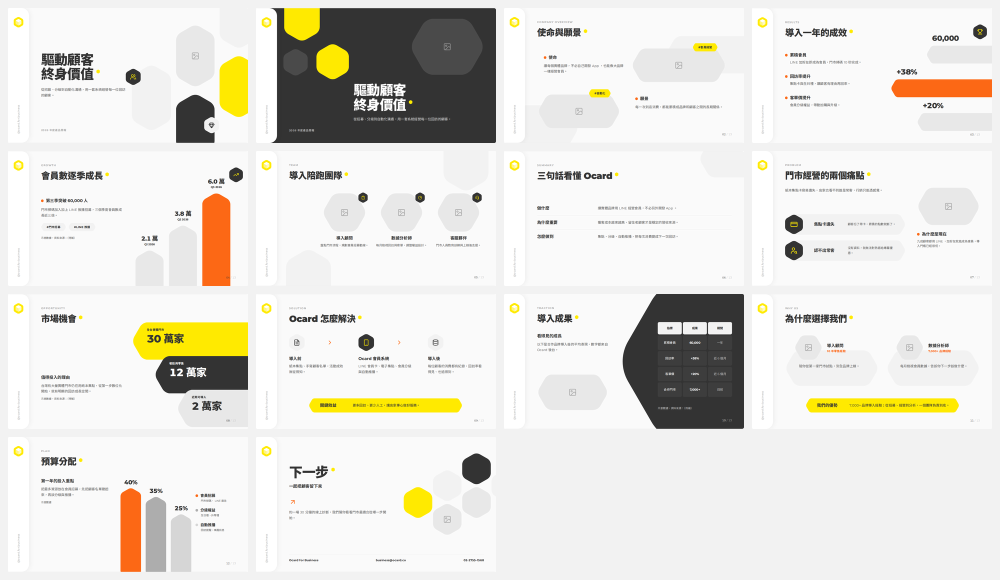

# 01 模板

> 最後更新：2026-10-06

三種簡報風格的範本。下載 HTML 用瀏覽器打開就能看；在 Claude 裡打開時可以調整、編輯文字、存檔，任何地方都能下載 PDF／PPTX（1920 × 1080）。

## 六角幾何拼貼（14 種版型）

檔案：[`六角幾何拼貼_261006.html`](六角幾何拼貼_261006.html)

<!-- 白底標準、墨底標準確認後加在這裡 -->
