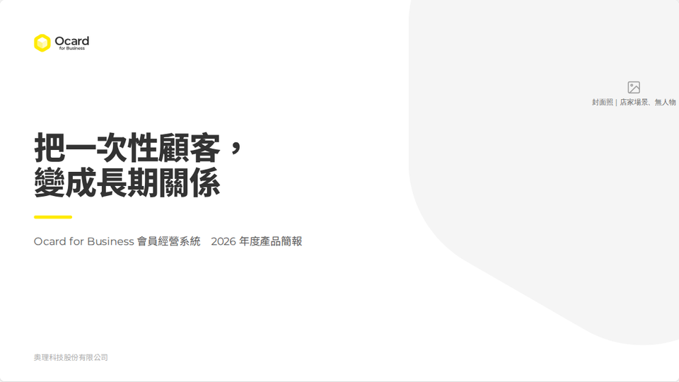
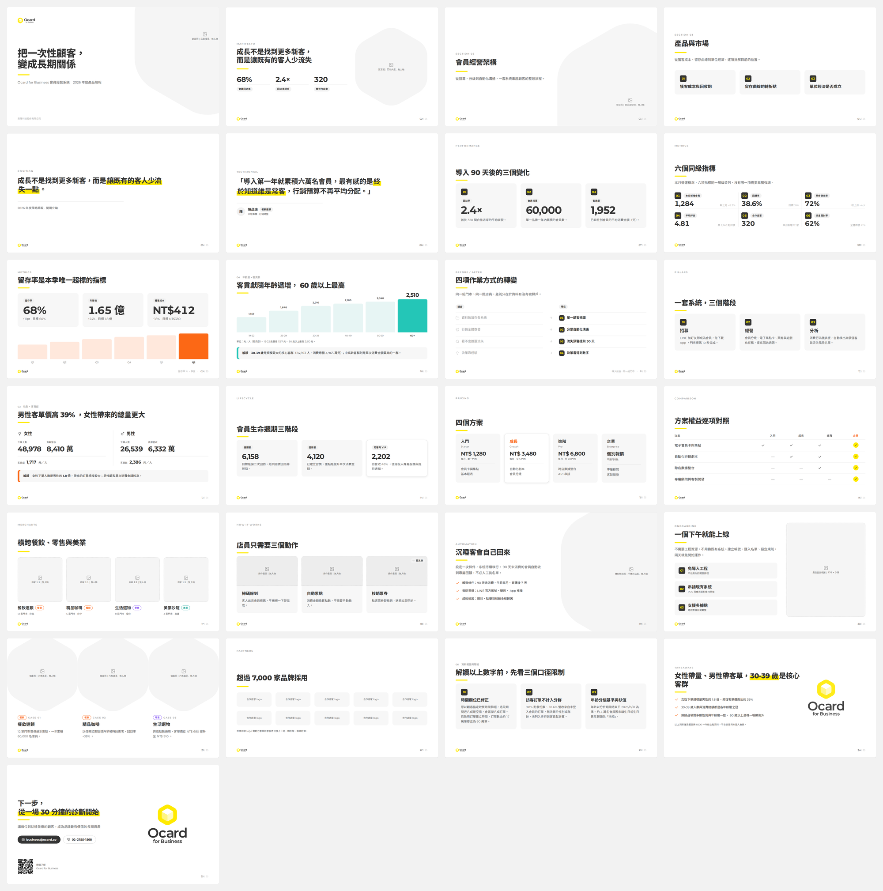
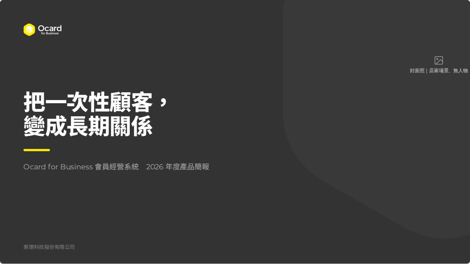
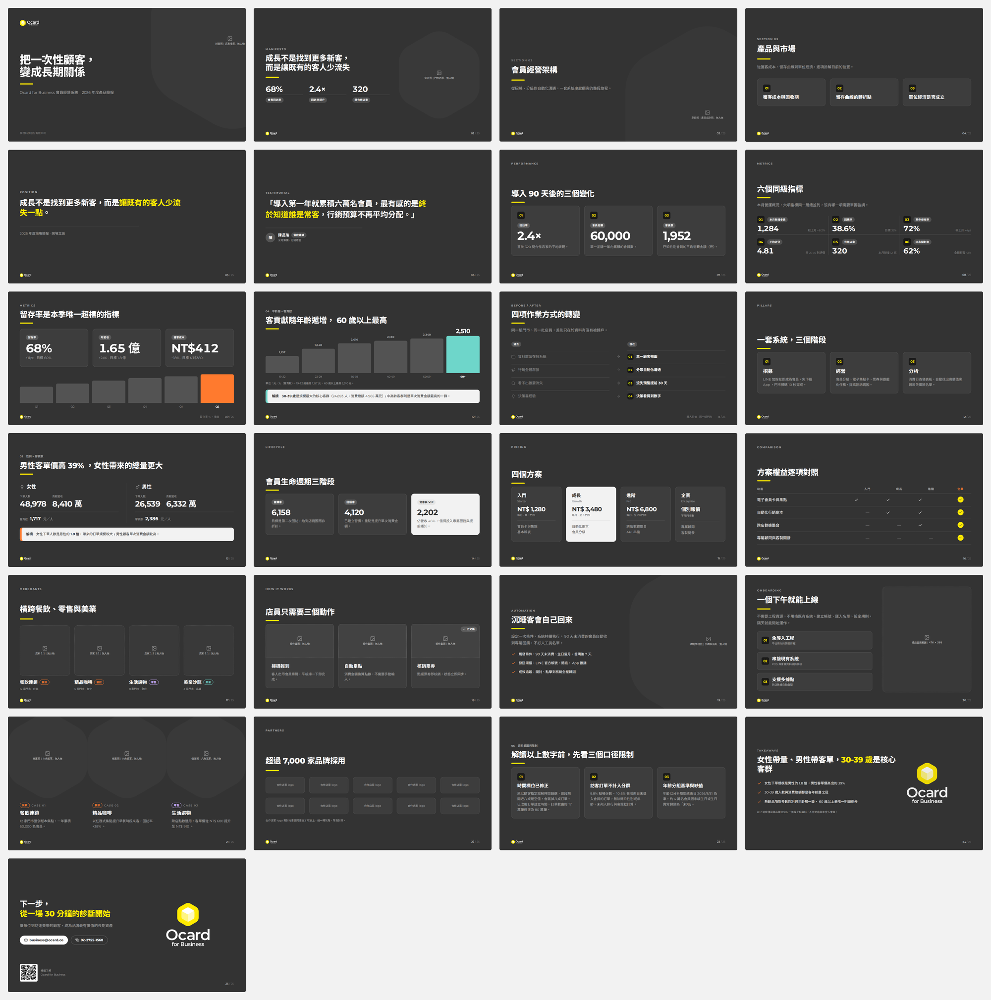

# 01 模板

> 最後更新：2026-10-06

三種簡報風格的範本。下載 HTML 用瀏覽器打開就能看；在 Claude 裡打開時可以調整、編輯文字、存檔，任何地方都能下載 PDF／PPTX（1920 × 1080）。

## 白底標準（25 種版型）

檔案：[`白底標準_261006.html`](白底標準_261006.html)

## 墨底標準（25 種版型）

檔案：[`墨底標準_261006.html`](墨底標準_261006.html)

## 六角幾何拼貼（14 種版型）

檔案：[`六角幾何拼貼_261006.html`](六角幾何拼貼_261006.html)

## 統計圖表

三個版型共用同一套圖表（KPI 小趨勢、折線／面積、直向／橫向／堆疊長條、甜甜圈、分段進度、漏斗、熱度表、時間軸），只換外觀。總覽：[`charts-preview.html`](../plugins/ocard-brand/skills/ocard-design/templates/_shared/charts/charts-preview.html)（外觀待確認，尚未放進版型）。
